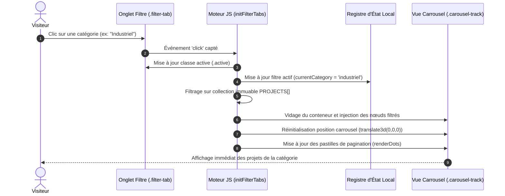
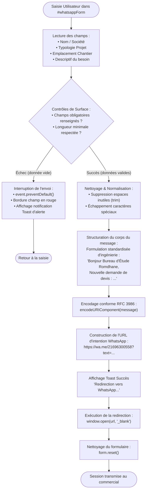

# 🔄 Cartographie des Flux Applicatifs & Données — Bureau Romdhane

| Document | Version | Domaine | Rédacteur |
|---|---|---|---|
| FLOW-SPEC-01 | 1.1 | Flux Données & Cycle Applicatif | Dhia Romdhane |

---

## 1. Vue d'Ensemble des Flux

Ce document modélise le cycle de vie des interactions utilisateurs et le traitement séquentiel des informations au sein de la plateforme web du **Bureau d'Étude Romdhane**.

L'application gère trois flux opérationnels distincts :
1. **Flux de Découverte & Filtrage du Catalogue (Flux Local Synchrone)**
2. **Flux d'Acquisition & Traitement du Devis (Flux de Données Sortant)**
3. **Flux de Rendu Graphique & Animation (Flux Événementiel Interne)**

---

## 2. Flux 1 — Consultation & Filtrage Dynamique des Références

Ce flux décrit le traitement séquentiel lors de la sélection d'un filtre de projet :



---

## 3. Flux 2 — Demande de Devis & Passerelle WhatsApp

Ce flux constitue le traitement central de données de l'application. Il illustre la démarche rigoureuse :
$$\text{Saisie} \longrightarrow \text{Validation/Contrôle} \longrightarrow \text{Transformation/Nettoyage} \longrightarrow \text{Formatage} \longrightarrow \text{Routage}$$



### Détail des Règles de Contrôle & Transformation

1. **Règle de Validation R-01 (Complétude) :** Les champs clés doivent comporter au minimum 2 caractères utiles après suppression des espaces de début et fin.
2. **Règle de Transformation R-02 (Normalisation) :** Les sauts de ligne sont convertis en retours chariot standard `%0A` afin de structurer la lecture sur smartphone pour l'ingénieur receveur.
3. **Règle de Sécurité R-03 (Encodage) :** Aucun texte brut n'est injecté dans l'URL. La fonction native `encodeURIComponent()` protège contre les ruptures de syntaxe et les injections malveillantes.
4. **Politique de Persistance R-04 (Non-stockage) :** **Aucune donnée nominative n'est conservée localement** (ni dans le `localStorage`, ni dans les `cookies`, ni sur un serveur intermédiaire). La confidentialité du visiteur est totale.

---

## 4. Flux 3 — Rendu Graphique du Canevas de Particules

Ce flux s'exécute en tâche de fond dans la boucle d'animation du navigateur :

```plaintext
[Cycle requestAnimationFrame (60 FPS)]
  │
  ├── 1. Effacement du canvas (ctx.clearRect)
  │
  ├── 2. Pour chaque particule i (0 à N) :
  │       • Mise à jour position : x += vx, y += vy
  │       • Détection rebond sur les bordures du viewport
  │       • Dessin du point nodale
  │
  ├── 3. Pour chaque paire (i, j) :
  │       • Calcul distance d = sqrt((x_j - x_i)² + (y_j - y_i)²)
  │       • Si d < distance_seuil :
  │           Calcul opacité = 1 - (d / distance_seuil)
  │           Tracé de la ligne reliant i et j (simulation treillis structurel)
  │
  └── 4. Demande du frame suivant
```

---

## 5. Matrice de Traçabilité des Données

| Donnée | Type | Source | Traitement | Destination | Durée de Rétention |
|---|---|---|---|---|---|
| **Nom du Client** | Chaîne de texte | Formulaire HTML | Trim, encodage URI | URL WhatsApp | 0 seconde (Volatile) |
| **Type de Structure** | Sélecteur / Texte | Formulaire HTML | Normalisation | URL WhatsApp | 0 seconde (Volatile) |
| **Ville du Projet** | Chaîne de texte | Formulaire HTML | Encodage URI | URL WhatsApp | 0 seconde (Volatile) |
| **Description** | Texte multiligne | Formulaire HTML | Formatage syntaxique | URL WhatsApp | 0 seconde (Volatile) |
| **Index Carrousel** | Entier | Événement UI | Incrément/Décrément | Variable mémoire | Durée de la session |
