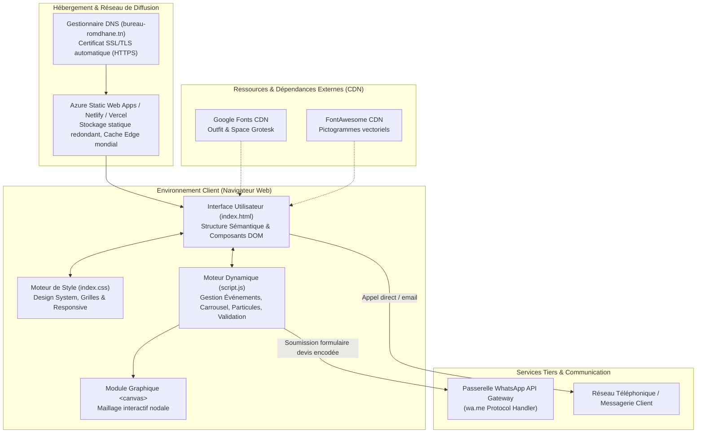

# Dossier d'Architecture Système — Bureau Romdhane

| Document | Version | Statut | Auteur |
|---|---|---|---|
| ARCH-DOC-01 | 1.1 | Validé | Dhia Romdhane |

---

## 1. Principes Directeurs d'Architecture

L'architecture logicielle de la plateforme **Bureau Romdhane** a été guidée par quatre exigences d'ingénierie :
1. **Frugalité et haute performance :** Rendu statique côté client (*Client-Side Static Rendering*) garantissant un score Google Lighthouse > 95/100 et un temps de premier affichage (*First Contentful Paint*) quasi instantané.
2. **Absence de dette d'infrastructure (Zero Maintenance) :** Aucun serveur d'application à maintenir, aucune base de données relationnelle exposée publiquement, éliminant tout risque d'attaque par injection SQL ou dépassement de mémoire côté serveur.
3. **Découplage modulaire :** Séparation stricte des responsabilités (Sémantique / Style / Comportement dynamique).
4. **Intégration d'API sans état (Stateless Integration) :** Utilisation du protocole d'intention WhatsApp (`https://wa.me/`) pour l'acheminement des données métiers vers le terminal du gestionnaire.

---

## 2. Diagramme d'Architecture Globale

Le schéma ci-dessous illustre l'architecture réelle et factuelle de la solution, depuis le terminal client jusqu'aux services d'hébergement et de communication :

---

## 3. Décomposition et Rôle des Composants

### 3.1. Couche Présentation (HTML5 / CSS3)
- **Rôle :** Offrir une structure sémantique propre, accessible et valorisant le référencement naturel.
- **Organisation CSS :**
  - Architecture basée sur des variables CSS personnalisées (`--primary`, `--accent`, `--bg-dark`, `--card-bg`).
  - Utilisation d'un système de mise en page hybride : CSS Grid pour les matrices rigides (grille des logiciels, blocs statistiques, services) et Flexbox pour les alignements dynamiques (barre de navigation, cartes du carrousel, modale lightbox).
  - Gestion des états réactifs (`:hover`, `:focus-visible`, `@media`) avec respect des préférences d'accessibilité utilisateur (`prefers-reduced-motion`).

### 3.2. Couche Métier & Interactivité (JavaScript ES6+)
- **Rôle :** Piloter l'expérience utilisateur et orchestrer les données sans surcharger le navigateur.
- **Gestion de l'État :**
  - Un état local léger maintient la catégorie active pour le filtrage (`currentCategory`), l'index du carrousel (`currentIndex`), l'état de l'auto-play (`autoPlayTimer`) et la visibilité de la modale d'agrandissement (`isLightboxOpen`).
  - Pas de mémoire tampon excessive : les données des réalisations sont initialisées sous forme de constantes immuables (`PROJECTS`).

### 3.3. Module d'Animation Canevas (`initParticles`)
- **Rôle :** Renforcer l'identité visuelle d'ingénierie structurelle par une métaphore graphique de nœuds de treillis.
- **Principe de calcul :**
  - Une collection de particules est instanciée avec des coordonnées vectorielles `(x, y)` et des vitesses `(vx, vy)`.
  - À chaque frame de `requestAnimationFrame`, le moteur calcule les distances euclidiennes entre toutes les paires de particules.
  - Lorsqu'une distance est inférieure à un seuil critique (`maxDistance`), une arête est dessinée avec une opacité inversement proportionnelle à la distance, modélisant un maillage éléments finis.

---

## 4. Choix d'Hébergement & Déploiement

La solution est optimisée pour l'hébergement de fichiers statiques avec cache réparti à l'échelle mondiale :
- **Microsoft Azure Static Web Apps :** Hébergement principal couplé à GitHub Actions pour une intégration et un déploiement continus (CI/CD).
- **Redondance multi-plateformes :** Configuration documentée pour déploiement instantané sur Netlify, Vercel ou Cloudflare Pages en cas d'expiration de souscription ou d'incident d'infrastructure.
- **Sécurité réseau :** Forçage systématique du protocole HTTPS avec certificats TLS gérés automatiquement par le fournisseur Edge.

---

## 5. Synthèse des Décisions d'Architecture (ADR)

| Décision | Option Retenue | Justification Technique |
|---|---|---|
| **Framework Front-End** | Vanilla JavaScript | Évite l'intégration de bundles volumineux (React/Vue font 150-300 ko minifiés) ; le projet n'a pas de complexité d'état justifiant un virtual DOM |
| **Persistance des Données** | Routage WhatsApp direct | Supprime la gestion d'une base de données relationnelle, le coût de maintenance backend et la surface d'attaque en cybersécurité |
| **Traitement d'Images** | Compression préalable Web | Réduit le poids total de la page sous la barre des 2 Mo, garantissant un affichage instantané sur les terminaux mobiles 3G/4G |
